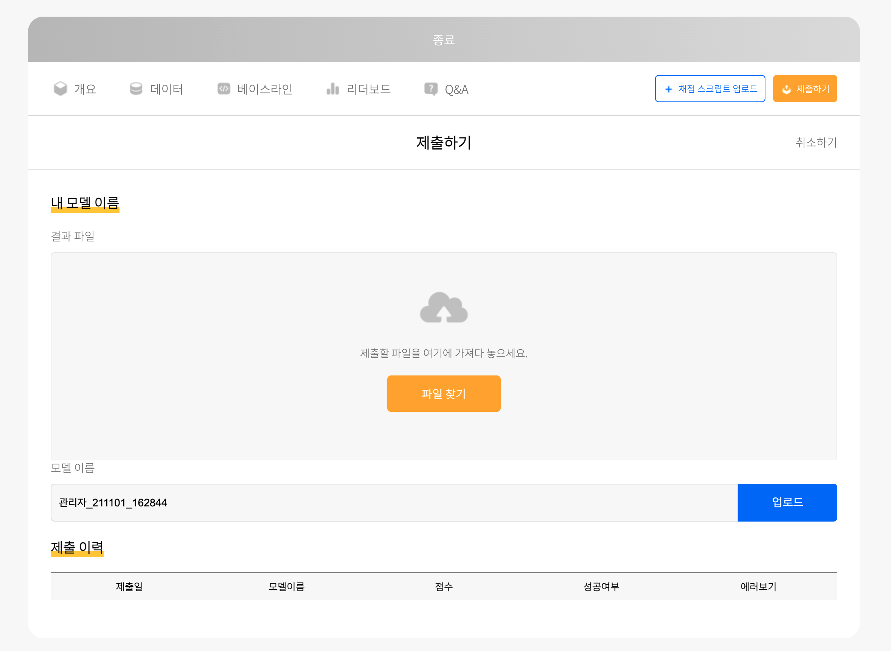

# aifactory-beta-tutorial
Tutorial for `AI Factory` python API

## 키 요청 가이드 
How-to-request-your-key

### 1. aifactory-beta 설치

아래 명령어로 `aifactory-beta` 패키지를 설치합니다.
잦은 업데이트가 예상되오니 오류가 발생할 경우에는 업데이트를 시도해봐주세요.
```angular2html
pip install aifactory-beta
# or
pip install aifactory-beta -u
```

### 2. `aifactory-request-key` 명령어 실행

아래 명령어를 실행해주세요.

```
aifactory-request-key                
```

### 3. 이메일 주소 입력

명령어를 입력하면 이메일 주소를 요구합니다.
인공지능 팩토리 플랫폼을 이용할 때 사용하시는 아이디를 입력해주세요.
해당 이메일 주소로 제출에 사용할 수 있는 키를 보내드립니다.

```angular2html
% aifactory-request-key
Please enter your user email: your-id@your-email-host.com
```

### 4. 실행 결과 확인

이메일을 못 받으신 경우 'log/' 폴더에 생기는 로그를 확인해주시고 스팸함도 확인해주세요.

또, 참여하신 *진행중* 태스크가 없으신 경우에도 키가 발송되지 않습니다.

키를 받으시려는 태스크 페이지에서 `대회 참여하기`를 꼭 눌러주세요!

## 제출 가이드

### 1. 키 저장

위의 키 요청 가이드를 참고해 먼저 키를 받아주세요.

키를 받으셨으면 `--key` 옵션을 이용해 키를 직접 입력하시거나 `sample_data/mykey.afk` 등의 텍스트 파일을 만들어 가장 윗줄에 키를 넣어놓고 사용하실 수 있습니다.

### 2. 정답 파일 확장자 확인

태스크마다 제출할 수 있는 파일 확장자 제한이 있습니다. 태스크페이지에서 확인 해주세요.

제출해야 하는 파일이 여러 개인 경우에는 제출할 파일을 하나의 폴더에 담고 그 폴더를 압축해서 제출해주세요.

예시) 아래 예시의 경우에는 `user_code/` 폴더를 압축해서 전송해주세요.

```angular2html
user_code/
    ├── my_code.py
    ├── requirements.txt
    └── my_model.h5
```

## 3. 정답 파일 제출

아래 명령어와 옵션을 이용해 키와 파일을 전송하실 수 있습니다.

- 키를 파일에 넣어서 이용하는 예시
```
aifactory-submit  \
    --key-path sample_data/my_key.afk \
    --file sample_data/answer.csv
```

- 키를 직접 입력하는 예시
```
aifactory-submit \
  --key 1234567somerandomekey7654321 \
  --file sample_data/answer.csv
```


### 4. 실행 결과 확인

실행 결과는 'log/' 폴더에 생기는 로그를 확인해주세요.

성공했을 경우에는 [예시 로그 파일](!log/SUBMISSION_sample.log) 안의 내용과 같이 `API call was successful.` 메세지를 확인하실 수 있습니다.
*기타 다른 에러 메세지에 대한 설명은 곧 업데이트 예정.*

또, 제출 성공시에는 사용자분의 제출 기록을 위해 사용된 모델 이름과 총 몇 번 제출하셨는지 (인증 성공 후 제출 시도 횟수)가 기록되어 있습니다.

*제출에는 횟수 제한이 걸려있습니다 태스크 페이지나 대회 주최 기관의 공지사항을 확인해주세요.*

*제출에 실패하셨을 경우에는 실패하셨을 때 생성된 로그를 첨부해서 대회 운영진에게 문의해주세요.*

### 5. 스코어 확인

스코어는 태스크 페이지의 `제출하기` 에서 확인하실 수 있습니다.

결과물 채점이 실패했을 경우에는 에러메세지 확인하기 기능으로 오류내용을 확인하실 수 있습니다.

제출 횟수 제한은 채점 '성공'을 기준으로 합니다.




### 6. 기타 사용 가능한 모든 옵션

```
aifactory-submit
  --key-path, -p  sample_data/my_key.afk
  --key, -k  1234567somerandomekey7654321
  --file, -f sample_data/answer.csv
  --log-dir ./log # 로그를 저장하는 디렉토리를 지정합니다.
  # --help, -h # 사용법을 확인합니다.
```

- 아래는 개발자 컨트리뷰터들을 위한 옵션입니다.
```
# options for contributors
  --debug, -d  False # 디버그 모드에서 실행합니다.
  --submit-url  http://submission.server.address # 제출 서버를 지정합니다.
```


### 7. 주의사항

- 제출한 파일은 최대 2 개 까지 저장됩니다. 채점이 오래 걸리는 경우에 채점이 끝나기 전에 추가로 제출하시면 그 이전에 제출하신 결과물이 채점되지 않을 수 있습니다.
